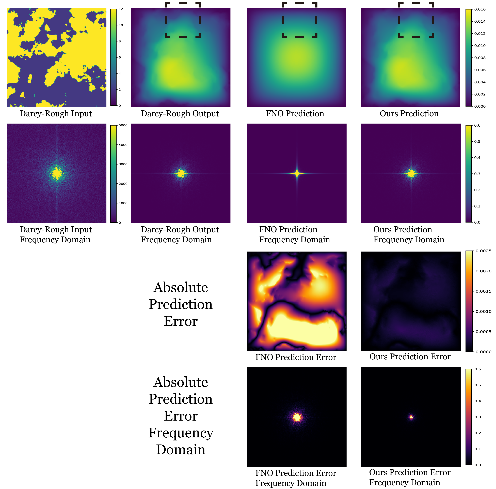
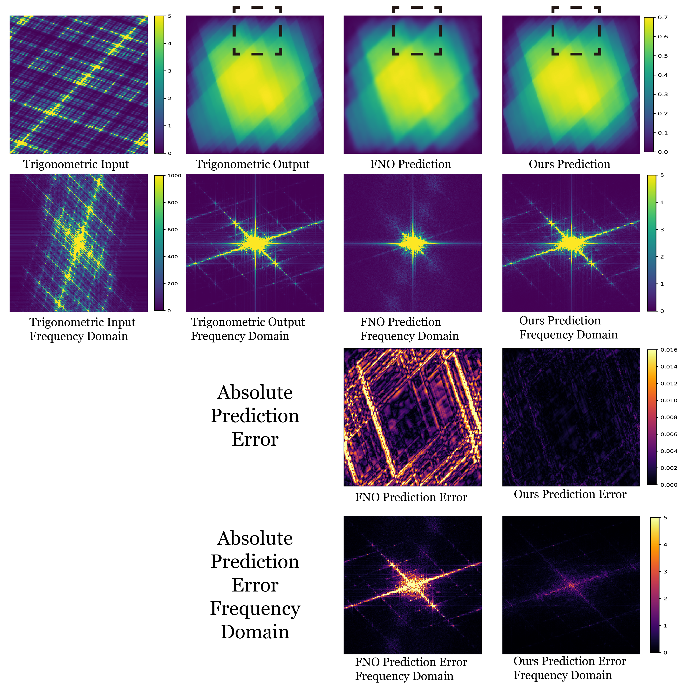

# kdd-rebuttal
## Visualization
We visualize the spatial domain and frequency domain inputs and outputs of multiscale elliptic equations. The first row shows that our model captures detailed information compared with FNO, this details belong to the high-frequency feature. The second row shows that both input coefficients and output solutions are mainly characterized by high frequency **(we shift the high-frequency feature into the center of the space)**. The third row shows that the prediction error of our model is much smaller. **The most important thing is shown in the last row**. This row indicates the prediction error in the frequency domain, from this row, our model achieves a much smaller high-frequency error compared to FNO. The last row confirmed that the FNO could not capture high-frequency features effectively, but our model could solve this problem. 

Fig 1: Darcy-Rough results.

Fig 2: Trigonometric results.
